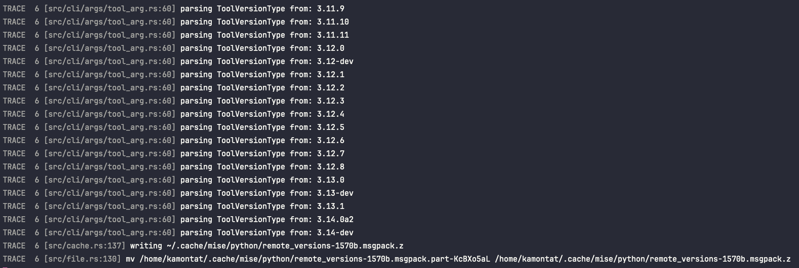

# Mise reproduce repository

> https://github.com/jdx/mise/discussions/3548

```bash
docker buildx build --tag mise-3548 .
docker run --rm -it mise-3548
```

After you run the docker, you will find your command stop at `mv` command:



To fix the problem, remove below from **mise.toml** file:

```toml
[env]
_.python.venv = { path = "{{ env.HOME }}/.cache/mise/venv", create = true }
```

I have no idea why the venv affected on `mv` command, but the workaround seem to works.
